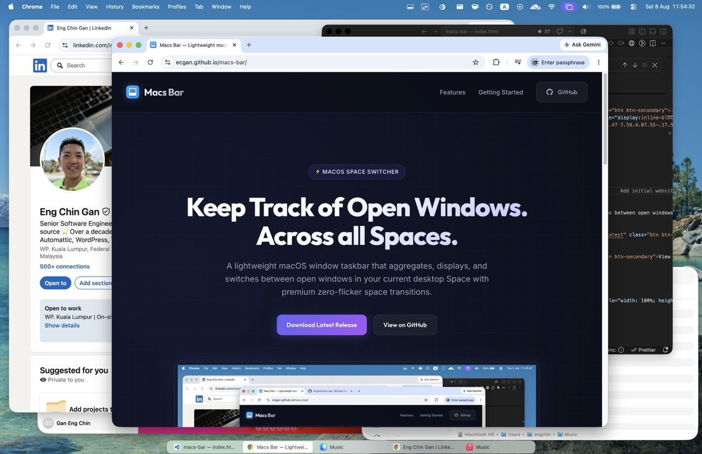

# Macs Bar

A lightweight macOS window taskbar that tracks and switches between open windows across desktop Spaces.

Macs Bar displays a compact taskbar panel showing all windows in your current Space. Click to switch windows, use keyboard shortcuts to navigate, and never lose track of what's open.



## Features

- **Real-time window tracking** across all macOS Spaces
- **Per-Space panels** that stay with their assigned Space during transitions
- **Multi-display support** with separate panels per display when "Displays have separate Spaces" is turned on in macOS settings
- **Keyboard shortcuts** to navigate windows
- **Fullscreen-aware** - panels hide automatically in fullscreen apps
- **Overlap-aware auto-hide** - the bar collapses when it would cover the focused window

## Installation

### Requirements

- macOS 14 or later
- Accessibility permissions (for window tracking and keyboard shortcuts)

### Download

1. Download `MacsBar.dmg` from the
   [latest release](https://github.com/ecgan/macs-bar/releases/latest).
2. Open the disk image.
3. Drag **MacsBar** onto the **Applications** shortcut.
4. Launch MacsBar from the Applications folder.

### Build from Source

```bash
# Configure your local signing identity
cp app/build.config.example app/build.config

# Build the app bundle
./scripts/build_app.py

# Run it
open app/MacsBar.app
```

Or run directly during development:

```bash
cd app
swift run MacsBar
```

### Permissions

macOS will prompt for Accessibility permissions. Grant these in **System Settings → Privacy & Security → Accessibility**.

Accessibility access is required to:

- Read window titles and application information
- Receive notifications when windows open, close, move, or change focus
- Activate windows when you click them in the taskbar
- Listen for global keyboard shortcuts

After granting the accessibility permissions, you may need to restart the app. The app will display a black task bar at the bottom of your screen, showing a list of your open windows in your desktop space.

## How It Works

Macs Bar uses a hybrid approach to track windows:

- **Accessibility notifications** for immediate updates when windows open, close, or change focus
- **Periodic polling** as a fallback, since macOS Accessibility notifications can be unreliable
- **CGWindowListCopyWindowInfo** for space-aware window enumeration

Each desktop Space gets its own `NSPanel` that stays pinned to that Space. This eliminates taskbar flicker during Space transitions—a common problem with single-panel approaches.

The app uses private macOS APIs (`CGSGetActiveSpace`, `CGSMoveWindowToSpace`) for Space detection and panel placement, inspired by patterns from [AeroSpace](https://github.com/nikitabobko/AeroSpace).

## Development

The project is split into two packages:

- **lib/** - `MacWindowTracker` library: core window tracking, Accessibility APIs, Space management
- **app/** - `MacsBar` application: UI, keyboard shortcuts, panel management

### Running Tests

```bash
# Library tests
cd lib && swift test

# App tests
cd app && swift test
```

### Project Structure

```text
macs-bar/
├── lib/                    # MacWindowTracker library
│   └── Sources/MacWindowTracker/
│       ├── AX/             # Accessibility API bindings
│       ├── CGWindow/       # CoreGraphics window/space APIs
│       ├── Core/           # WindowTracker, TrackedWindow
│       └── Monitor/        # Display management
├── app/                    # MacsBar application
│   └── Sources/MacsBar/
├── docs/                   # Public website powered by GitHub Pages
└── plans/                  # Design documents and plans
```

## License

GPL-3.0 - see [LICENSE](LICENSE) for details.
